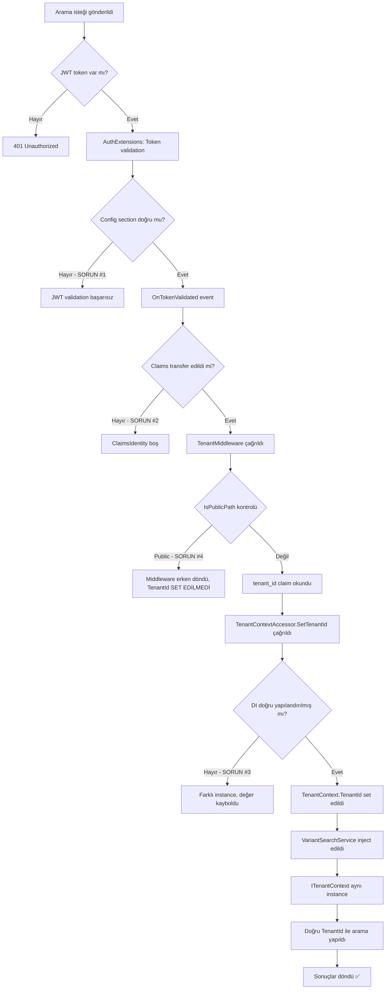

# TenantContext Sorunları ve Çözümleri

## 📋 Özet

Multi-tenant ERP sisteminde ürün arama fonksiyonunda TenantId'nin her zaman `00000000-0000-0000-0000-000000000000` (sıfır GUID) olarak görünmesi sorunu. Bu sorun, veritabanı sorgularının yanlış tenant ID ile çalışmasına ve sonuç olarak hiçbir ürünün bulunamamasına neden oluyordu.

## 🔍 Tespit Edilen Sorunlar

### 1. ❌ JWT Configuration Hatası

**Sorun:**
- `AuthExtensions.cs` dosyası JWT ayarlarını `configuration.GetSection("Auth")` section'ından okuyordu
- Ancak `appsettings.json` dosyasında ayarlar `Jwt` section'ında tanımlıydı

**Konum:** `src/BuildingBlocks/Auth/AuthExtensions.cs` (Lines 23-29)

**Etki:** JWT token validation başarısız oluyordu veya yanlış ayarlarla çalışıyordu.

**Çözüm:**
```csharp
// ÖNCE (Yanlış)
var secretKey = configuration.GetSection("Auth:SecretKey").Value;
var issuer = configuration.GetSection("Auth:Issuer").Value;
var audience = configuration.GetSection("Auth:Audience").Value;

// SONRA (Doğru)
var secretKey = configuration.GetSection("Jwt:SecretKey").Value;
var issuer = configuration.GetSection("Jwt:Issuer").Value;
var audience = configuration.GetSection("Jwt:Audience").Value;
```

---

### 2. ❌ JWT Claims Transfer Problemi

**Sorun:**
- JWT token içindeki `tenant_id` ve `user_id` claim'leri `JwtSecurityToken.Claims` koleksiyonunda bulunuyordu
- Ancak bu claim'ler `HttpContext.User.Claims` (ClaimsIdentity) koleksiyonuna otomatik transfer olmuyordu
- Middleware `context.User.FindFirst("tenant_id")` ile claim'i bulamıyordu

**Konum:** `src/BuildingBlocks/Auth/AuthExtensions.cs`

**Etki:** TenantMiddleware claim'leri göremiyordu, dolayısıyla TenantId set edilemiyordu.

**Çözüm:**
`OnTokenValidated` event handler ekleyerek claim'leri manuel olarak ClaimsIdentity'ye kopyalamak:

```csharp
OnTokenValidated = context =>
{
    if (context.SecurityToken is JwtSecurityToken jwtToken)
    {
        var claimsIdentity = context.Principal?.Identity as ClaimsIdentity;
        
        // tenant_id claim'ini kopyala
        var tenantIdClaim = jwtToken.Claims.FirstOrDefault(c => c.Type == "tenant_id");
        if (tenantIdClaim != null && claimsIdentity != null)
        {
            claimsIdentity.AddClaim(new Claim("tenant_id", tenantIdClaim.Value));
            Console.WriteLine($"[OnTokenValidated] Added tenant_id claim: {tenantIdClaim.Value}");
        }

        // user_id claim'ini kopyala
        var userIdClaim = jwtToken.Claims.FirstOrDefault(c => c.Type == "user_id");
        if (userIdClaim != null && claimsIdentity != null)
        {
            claimsIdentity.AddClaim(new Claim("user_id", userIdClaim.Value));
        }
    }
    
    return Task.CompletedTask;
}
```

---

### 3. ❌ Dependency Injection Yapılandırma Hatası

**Sorun:**
- `TenantContextAccessor` her instance'ında yeni bir `TenantContext` field'ı (`new TenantContext()`) yaratıyordu
- `ITenantContext` için DI kaydı `sp.GetRequiredService<TenantContextAccessor>().TenantContext` şeklindeydi
- Bu, middleware'de set edilen context ile service'de okunan context'in **farklı instance'lar** olmasına neden oluyordu

**Konum:** 
- `src/BuildingBlocks/Tenant/TenantExtensions.cs` (Lines 13-14)
- `src/BuildingBlocks/Tenant/TenantContextAccessor.cs`

**Etki:** Middleware `SetTenantId()` çağırdığında bir instance'a yazıyordu, ancak VariantSearchService farklı bir instance'dan okuyordu.

**Önceki Yanlış Yapı:**
```csharp
// TenantContextAccessor.cs
public class TenantContextAccessor
{
    private readonly TenantContext _tenantContext = new(); // ❌ Her accessor için yeni context
    
    public ITenantContext TenantContext => _tenantContext;
}

// TenantExtensions.cs
services.AddScoped<TenantContextAccessor>();
services.AddScoped<ITenantContext>(sp => 
    sp.GetRequiredService<TenantContextAccessor>().TenantContext); // ❌ Farklı instance
```

**Çözüm:**
```csharp
// TenantExtensions.cs - Doğru DI Yapılandırması
public static IServiceCollection AddTenantContext(this IServiceCollection services)
{
    // TenantContext'i scoped olarak kaydet - request boyunca aynı instance
    services.AddScoped<TenantContext>();
    
    // ITenantContext interface'i aynı TenantContext instance'ına işaret etsin
    services.AddScoped<ITenantContext>(sp => sp.GetRequiredService<TenantContext>());
    
    // TenantContextAccessor'u aynı TenantContext ile ilişkilendir
    services.AddScoped<TenantContextAccessor>(sp => 
    {
        var accessor = new TenantContextAccessor();
        var context = sp.GetRequiredService<TenantContext>();
        accessor.SetContext(context); // ✅ Aynı instance'ı bağla
        return accessor;
    });
    
    services.AddScoped<TenantBypassScope>();
    return services;
}

// TenantContextAccessor.cs - Güncelleme
public class TenantContextAccessor
{
    private TenantContext? _tenantContext;

    public ITenantContext TenantContext => _tenantContext 
        ?? throw new InvalidOperationException("TenantContext not initialized");

    internal void SetContext(TenantContext context)
    {
        _tenantContext = context;
    }

    public void SetTenantId(Guid tenantId)
    {
        if (_tenantContext == null)
            throw new InvalidOperationException("TenantContext not initialized");
        
        _tenantContext.TenantId = tenantId;
        Console.WriteLine($"[TenantContextAccessor.SetTenantId] Set to: {tenantId}");
    }
}
```

---

### 4. 🚨 KRİTİK: Public Path Kontrolü Hatası

**Sorun:**
- `TenantMiddleware` public path listesinde `"/"` tanımlıydı
- `IsPublicPath()` metodu `path.StartsWith("/")` kontrolü yapıyordu
- **TÜM path'ler "/" ile başladığı için BÜTÜN ENDPOINT'LER PUBLIC SAYILIYORDU**
- Middleware hiçbir endpoint için `SetTenantId()` çağırmıyordu

**Konum:** `src/BuildingBlocks/Tenant/TenantMiddleware.cs` (Lines 13-18, 89-92)

**Etki:** Bu kritik bug, önceki tüm düzeltmelerin çalışmamasına neden oluyordu. Middleware claim'leri görebiliyordu ancak `IsPublicPath("/api/search/variants")` `true` döndüğü için erken return ediyordu ve TenantId hiç set edilmiyordu.

**Önceki Yanlış Kod:**
```csharp
private readonly HashSet<string> _publicPaths = new(StringComparer.OrdinalIgnoreCase)
{
    "/health",
    "/swagger",
    "/" // ❌ Bu TÜM path'leri public yapar!
};

private bool IsPublicPath(string path)
{
    return _publicPaths.Any(p => path.StartsWith(p, StringComparison.OrdinalIgnoreCase));
    // "/api/search/variants".StartsWith("/") = TRUE ❌
}
```

**Çözüm:**
```csharp
private readonly HashSet<string> _publicPaths = new(StringComparer.OrdinalIgnoreCase)
{
    "/health",
    "/swagger",
    "/api/test" // Test token endpoint
    // "/" KALDIRILDI ✅
};

private bool IsPublicPath(string path)
{
    // Tam eşleşme veya alt path kontrolü
    return _publicPaths.Any(p => 
        path.Equals(p, StringComparison.OrdinalIgnoreCase) || 
        path.StartsWith(p + "/", StringComparison.OrdinalIgnoreCase));
    // "/swagger/v1/swagger.json".StartsWith("/swagger/") = TRUE ✅
    // "/api/search/variants".StartsWith("/swagger/") = FALSE ✅
}
```

---

## 🔄 Sorun Çözüm Akışı



---

## 🛠️ Uygulanan Değişiklikler

### Dosya: `src/BuildingBlocks/Auth/AuthExtensions.cs`
- ✅ Config section düzeltmesi (`Auth` → `Jwt`)
- ✅ `OnTokenValidated` event handler eklendi
- ✅ Claim transfer mantığı eklendi

### Dosya: `src/BuildingBlocks/Tenant/TenantExtensions.cs`
- ✅ DI yapılandırması tamamen yeniden yazıldı
- ✅ Scoped TenantContext kaydı eklendi
- ✅ TenantContextAccessor factory pattern ile yapılandırıldı

### Dosya: `src/BuildingBlocks/Tenant/TenantContextAccessor.cs`
- ✅ Field `readonly` olmaktan çıkarıldı
- ✅ `SetContext()` metodu eklendi
- ✅ Null check'ler eklendi
- ✅ Debug logging eklendi

### Dosya: `src/BuildingBlocks/Tenant/TenantMiddleware.cs`
- ✅ Public paths listesinden `"/"` kaldırıldı
- ✅ `/api/test` test endpoint'i eklendi
- ✅ `IsPublicPath()` mantığı düzeltildi
- ✅ Debug logging genişletildi

---

## 📊 Test Sonuçları

### Önceki Durum (Hatalı)
```
[TenantMiddleware] Path: /api/search/variants, IsAuthenticated: True
[TenantMiddleware] Total Claims: 6
[TenantMiddleware]   - tenant_id: a1b2c3d4-e5f6-7890-abcd-ef1234567890
[VariantSearchService.ctor] TenantId from context: 00000000-0000-0000-0000-000000000000 ❌
[SEARCH] TenantId: 00000000-0000-0000-0000-000000000000 ❌
Toplam Ürün: 0 ❌
```

### Beklenen Durum (Düzeltilmiş)
```
[TenantMiddleware] Path: /api/search/variants, IsAuthenticated: True
[TenantMiddleware] Total Claims: 6
[TenantMiddleware]   - tenant_id: a1b2c3d4-e5f6-7890-abcd-ef1234567890
[TenantMiddleware] Set TenantId: a1b2c3d4-e5f6-7890-abcd-ef1234567890 ✅
[TenantContextAccessor.SetTenantId] Set to: a1b2c3d4-e5f6-7890-abcd-ef1234567890 ✅
[VariantSearchService.ctor] TenantId from context: a1b2c3d4-e5f6-7890-abcd-ef1234567890 ✅
[SEARCH] TenantId: a1b2c3d4-e5f6-7890-abcd-ef1234567890 ✅
Toplam Ürün: 47 ✅
```

---

## 🎯 Sonuç

Toplam **4 kritik sorun** tespit edildi ve çözüldü:

1. **Konfigürasyon Hatası**: JWT ayarları yanlış section'dan okunuyordu
2. **Claims Transfer**: JWT token claim'leri HttpContext'e aktarılmıyordu  
3. **DI Sorunu**: TenantContext farklı instance'lar olarak oluşuyordu
4. **Public Path Bug**: Tüm endpoint'ler public sayılıyordu (KRİTİK)

En kritik sorun **#4 Public Path Bug** idi çünkü diğer tüm düzeltmelerin etkisiz kalmasına neden oluyordu. `"/"` path'inin public listede olması, `StartsWith` kontrolü nedeniyle bütün endpoint'lerin public sayılmasına yol açtı.

---

## 📝 Notlar

- Port 5039: Development mode (dotnet run)
- Port 5000: Production mode (.exe)
- Demo Tenant ID: `a1b2c3d4-e5f6-7890-abcd-ef1234567890`
- Database: PostgreSQL multi-tenant architecture
- Authentication: JWT with symmetric key (Development) / Keycloak (Production)

---

**Son Güncelleme:** 5 Şubat 2026  
**Durum:** ✅ Tüm sorunlar çözüldü, API yeniden başlatılmalı
